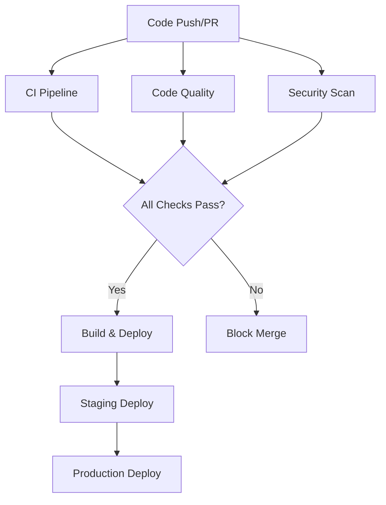

# GitHub Actions CI/CD Setup Guide

This document outlines the comprehensive CI/CD, security, and code quality
automation implemented for the mimi-context project.

## 🚀 Workflows Overview

### 1. CI/CD Pipeline (`ci.yml`)

**Trigger**: Push/PR to main/develop branches
**Purpose**: Comprehensive testing and validation

**Jobs:**

- **Backend Testing**: Tests Python FastAPI application across Python 3.9-3.11
- **Frontend Testing**: Tests React/TypeScript application across Node.js 18.x-20.x
- **Integration Testing**: End-to-end testing with backend and frontend together
- **Coverage Reporting**: Uploads test coverage to Codecov

**Features:**

- Matrix builds for multiple Python/Node versions
- Dependency caching for faster builds
- Database initialization and seeding
- Health checks and API validation
- Coverage reporting with Codecov integration

### 2. Code Quality (`code-quality.yml`)

**Trigger**: Push/PR to main/develop branches
**Purpose**: Enforce code standards and style

**Backend Quality Checks:**

- **Black**: Code formatting
- **isort**: Import sorting
- **flake8**: Linting and style guide enforcement
- **mypy**: Type checking
- **bandit**: Security linting
- **safety**: Vulnerability checking

**Frontend Quality Checks:**

- **Prettier**: Code formatting
- **ESLint**: Linting and best practices
- **TypeScript**: Type checking
- **Circular Dependency Detection**: Prevents dependency cycles

**Additional Checks:**

- **Markdown linting**: Documentation quality
- **YAML validation**: Configuration file validation
- **Dockerfile linting**: Container best practices

### 3. Security Scanning (`security.yml`)

**Trigger**: Push/PR + Daily at 2 AM UTC
**Purpose**: Comprehensive security analysis

**Security Features:**

- **Trivy**: File system and container vulnerability scanning
- **pip-audit**: Python dependency vulnerability checking
- **npm audit**: Node.js dependency vulnerability checking
- **GitLeaks**: Secrets and credential scanning
- **CodeQL**: Advanced static analysis for security issues
- **Bandit**: Python security linting
- **OWASP ZAP**: Web application security scanning (scheduled)

**SARIF Integration**: Results uploaded to GitHub Security tab for centralized viewing

### 4. Build & Deploy (`deploy.yml`)

**Trigger**: Successful CI completion + tags
**Purpose**: Automated deployment pipeline

**Build Process:**

- **Docker Images**: Backend containerization with multi-stage builds
- **Static Assets**: Frontend build optimization
- **Registry Push**: Images pushed to GitHub Container Registry
- **Artifact Management**: Build artifacts stored and managed

**Deployment Stages:**

- **Staging**: Automatic deployment on main branch
- **Production**: Deployment on version tags
- **Rollback**: Automatic rollback on failure
- **Health Checks**: Post-deployment validation

### 5. Dependency Management (`dependabot.yml`)

**Purpose**: Automated dependency updates

**Coverage:**

- **Python packages**: Weekly Monday updates
- **Node.js packages**: Weekly Tuesday updates
- **Docker images**: Weekly Wednesday updates
- **GitHub Actions**: Weekly Thursday updates

**Features:**

- Automated PR creation for updates
- Security-first update prioritization
- Customizable update schedules
- Reviewer assignment and labeling

## 🔧 Configuration Files

### Security Configurations

- `.gitleaks.toml`: Custom secrets detection rules
- `.markdownlint.json`: Documentation quality standards
- `.markdown-link-check.json`: Link validation settings

### Code Quality Configurations

- `pyproject.toml`: Python tooling configuration (Black, isort, mypy, pytest)
- Enhanced `.gitignore`: Comprehensive exclusion of sensitive files

### Environment Templates

- `mimi-core/.env.example`: Backend environment variables
- `mimi-web/.env.example`: Frontend environment variables

## 📋 GitHub Templates

### Pull Request Template

Comprehensive checklist covering:

- Change description and type classification
- Testing requirements
- Security review checklist
- Code quality standards
- Breaking change documentation
- Reviewer guidelines

### Issue Templates

- **Bug Report**: Structured bug reporting with environment details
- **Feature Request**: Detailed feature planning template
- **Security Vulnerability**: Responsible disclosure template

## 🛡️ Security Features

### Secrets Management

- **Never commit secrets**: Templates and documentation emphasize this
- **Environment variables**: All sensitive data via environment configuration
- **GitLeaks scanning**: Automated detection of accidentally committed secrets
- **Security policy**: Clear guidelines for reporting vulnerabilities

### Dependency Security

- **Automated vulnerability scanning**: Multiple tools for comprehensive coverage
- **Daily security scans**: Scheduled vulnerability detection
- **Dependabot integration**: Automated security updates
- **SARIF reporting**: Centralized security findings

### Container Security

- **Multi-stage Docker builds**: Minimal attack surface
- **Container scanning**: Trivy integration for container vulnerabilities
- **Base image updates**: Dependabot manages Docker image updates

## 🚀 Getting Started

### 1. Repository Setup

```bash
# Clone and setup the repository
git clone https://github.com/ettyfwebit/mimi-context.git
cd mimi-context

# Setup backend
cd mimi-core
cp .env.example .env
# Edit .env with your configuration
pip install -r requirements.txt

# Setup frontend
cd ../mimi-web
cp .env.example .env.local
# Edit .env.local with your configuration
npm install
```

### 2. Required Secrets

Add these secrets to your GitHub repository settings:

**Required:**

- `GITHUB_TOKEN`: Automatically provided by GitHub

**Optional (for enhanced features):**

- `CODECOV_TOKEN`: For coverage reporting
- `GITLEAKS_LICENSE`: For GitLeaks Pro features
- Deployment secrets (AWS credentials, etc.)

### 3. Environment Configuration

Update the deployment workflows with your specific:

- Container registry settings
- Deployment target configurations
- Notification endpoints
- Health check URLs

## 📊 Monitoring & Reporting

### Coverage Reporting

- **Backend**: pytest-cov generates coverage reports
- **Frontend**: Vitest generates coverage reports
- **Codecov**: Centralized coverage tracking and PR comments

### Security Dashboard

- **GitHub Security Tab**: SARIF results from all security scans
- **Dependabot Alerts**: Automated vulnerability notifications
- **CodeQL Results**: Advanced security analysis findings

### Code Quality Metrics

- **Build Status**: CI/CD pipeline status badges
- **Coverage Badges**: Test coverage visualization
- **Dependency Status**: Automated dependency health monitoring

## 🔄 Workflow Dependencies



## 🛠️ Maintenance

### Regular Tasks

- **Review security scan results**: Weekly security dashboard review
- **Update dependencies**: Review and merge Dependabot PRs
- **Monitor build performance**: Track CI/CD execution times
- **Update workflows**: Quarterly review and updates

### Performance Optimization

- **Caching Strategy**: Dependencies cached for faster builds
- **Matrix Optimization**: Parallel job execution
- **Artifact Management**: Efficient storage and retrieval

---

## 📚 Additional Resources

- [GitHub Actions Documentation](https://docs.github.com/en/actions)
- [Security Best Practices](./SECURITY.md)
- [Contributing Guidelines](./CONTRIBUTING.md)
- [Code of Conduct](./CODE_OF_CONDUCT.md)

This CI/CD setup provides enterprise-grade automation for development, security,
and deployment processes while maintaining developer productivity and code quality
standards.
